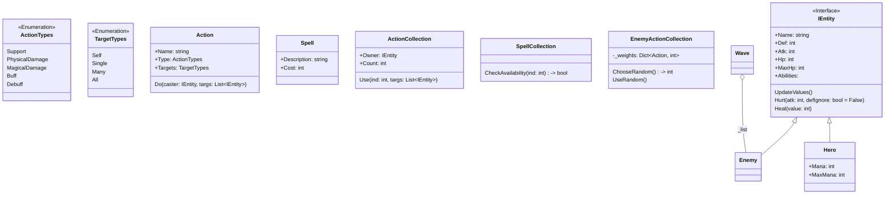

```mermaid
classDiagram
    %%I'm trying to understand how will attacks even work here. I did mess up by adding all those enemies before I even finalized this stuff, but that's just what it is. I'm writing this in advance as a little log of sorts, lol

    %%I am thinking of making it so main mana calculations fall onto Action, plus possible changes in how attacks behave (for example, changing the damage from the attack based on health of either the caster or target)
    class Enemy

    class ActionTypes{
        <<Enumeration>>
        Support
        PhysicalDamage
        MagicalDamage
        Buff
        Debuff
    }

    class TargetTypes{
        <<Enumeration>>
        Self
        Single
        Many
        All
    }

    class Action{
        +Name: string
        +Type: ActionTypes
        +Targets: TargetTypes
        Do(caster: IEntity, targs: List~IEntity~)
    }

    class Spell{
        +Description: string
        +Cost: int
    }

    class ActionCollection{
        +Owner: IEntity
        +Count: int
        Use(ind: int, targs: List~IEntity~)
    }

    class SpellCollection{
        %%Used by UI to stop Hero from even using the spell to begin with
        CheckAvailability(ind: int) -> bool
    }

    class EnemyActionCollection{
        -_weights: Dict~Action, int~
        ChooseRandom() -> int
        UseRandom()
    }

    class Wave

    class IEntity{
        <<Interface>>
        +Name: string
        +Def: int
        +Atk: int
        +Hp: int
        +MaxHp: int
        +Abilities: 
        UpdateValues()
        Hurt(atk: int, defIgnore: bool = False)
        Heal(value: int)
    }

    class Hero{
        +Mana: int
        +MaxMana: int
    }

    IEntity <|-- Enemy
    IEntity <|-- Hero
    Wave o-- Enemy: _list
```