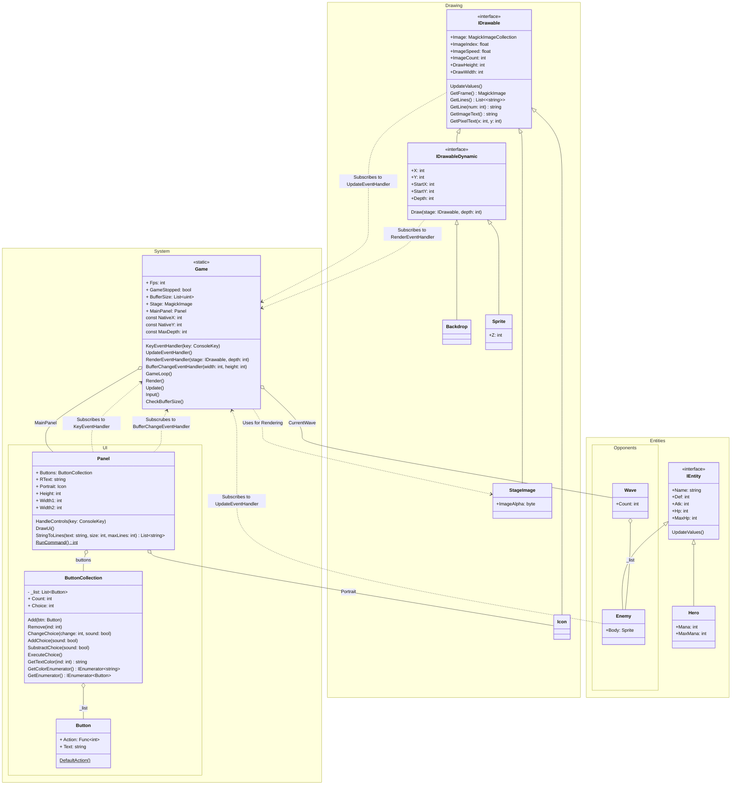

```mermaid
classDiagram
    namespace System{
        class Game{
            <<static>>
            + Fps: int
            + GameStopped: bool
            + BufferSize: List~uint~
            + Stage: MagickImage
            + MainPanel: Panel
            const NativeX: int
            const NativeY: int
            const MaxDepth: int
            KeyEventHandler(key: ConsoleKey)
            UpdateEventHandler()
            RenderEventHandler(stage: IDrawable, depth: int)
            BufferChangeEventHandler(width: int, height: int)
            GameLoop()
            Render()
            Update()
            Input()
            CheckBufferSize()
        }
    }

    %%May change to Drawing.UI later on, for now it's System
    namespace System.UI{
        class Button{
            + Action: Func~int~
            + Text: string
            DefaultAction()$
        }

        class ButtonCollection{
            - _list: List~Button~
            + Count: int
            + Choice: int
            Add(btn: Button)
            Remove(ind: int)
            ChangeChoice(change: int, sound: bool)
            AddChoice(sound: bool)
            SubstractChoice(sound: bool)
            ExecuteChoice() 
            GetTextColor(ind: int) string
            GetColorEnumerator() IEnumerator~string~
            GetEnumerator() IEnumerator~Button~
        }

        class Panel{
            + Buttons: ButtonCollection
            + RText: string
            + Portrait: Icon
            %%Next three variables may change later on. Will probably only have Height and Width, but for now it uses these three
            + Height: int
            + Width1: int
            + Width2: int
            HandleControls(key: ConsoleKey)
            DrawUi()
            StringToLines(text: string, size: int, maxLines: int) List~string~
            RunCommand() int$
        }
    }

    namespace Drawing{
        class IDrawable{
            <<interface>>
            +Image: MagickImageCollection
            +ImageIndex: float
            +ImageSpeed: float
            +ImageCount: int
            +DrawHeight: int
            +DrawWidth: int
            UpdateValues()
            GetFrame() MagickImage
            GetLines() List~~string~~
            GetLine(num: int) string
            GetImageText() string
            GetPixelText(x: int, y: int)
        }

        class IDrawableDynamic{
            <<interface>>
            +X: int
            +Y: int
            +StartX: int
            +StartY: int
            +Depth: int
            Draw(stage: IDrawable, depth: int)
        }

        class Backdrop{

        }

        class Sprite{
            +Z: int
        }

        class Icon{

        }

        class StageImage{
            +ImageAlpha: byte
        }
    }

    namespace Entities{
        class IEntity{
            <<interface>>
            +Name: string
            +Def: int
            +Atk: int
            +Hp: int
            +MaxHp: int
            UpdateValues()
        }

        class Hero{
            +Mana: int
            +MaxMana: int
        }
    }

    namespace Entities.Opponents{
        class Enemy{
            +Body: Sprite
        }

        class Wave{
            +Count: int
        }

    }

    ButtonCollection o-- Button: _list
    Panel o-- ButtonCollection: buttons
    Panel o-- Icon: Portrait
    Panel ..> Game: Subscribes to KeyEventHandler
    Panel ..> Game: Subscrubes to BufferChangeEventHandler

    IEntity <|-- Enemy
    IEntity <|-- Hero
    Enemy ..> Game: Subscribes to UpdateEventHandler

    Wave o-- Enemy: _list

    Game o-- Wave: CurrentWave
    Game o-- Panel: MainPanel
    Game ..> StageImage: Uses for Rendering
    
    IDrawable <|-- IDrawableDynamic
    IDrawable <|-- Icon
    IDrawable <|-- StageImage
    IDrawable ..> Game: Subscribes to UpdateEventHandler
    IDrawableDynamic ..> Game: Subscribes to RenderEventHandler
    IDrawableDynamic <|-- Backdrop
    IDrawableDynamic <|-- Sprite
```